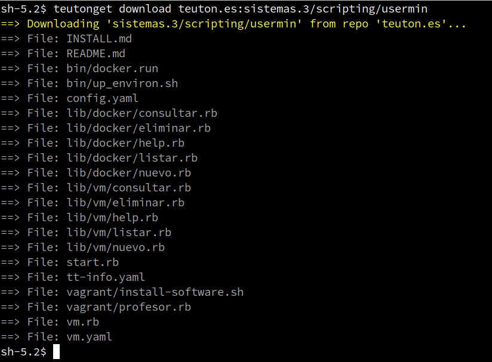
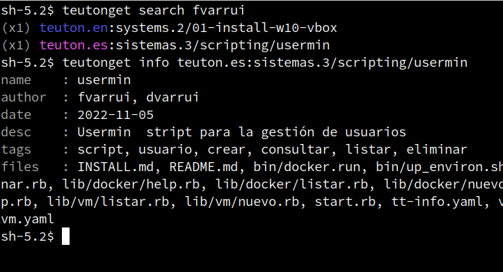

# Teuton-Get

* Find and download _Teuton Tests_ from remote or local repositories.
* Create _Teuton Test_ repository.

# Installation

1. Install Ruby on your system.
1. `gem install teuton-get`, to install **teuton-get** gem.

# Use

* At first, create config file with `teutonget init`.
* Then, search tests with `teutonget search FILTER`. Example: `teutonget search linux`, will show a list with "linux" related tests.

* `teutonget download REPONAME:TESTPATH`

## Example

* Search and download test:

* Refresh repos and show test details:

# Contact

* **Email**: `teuton.software@protonmail.com`

# Documentation

* [Settings](docs/settings.md)
* [Get](docs/get.md)
* [Repository](docs/repo.md)
* [Commands](docs/commands.md)
