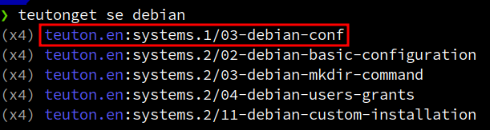

# Teuton-Get

[](https://badge.fury.io/rb/teuton-get)


* Find and download _Teuton Tests_ from remote or local repositories.
* Create _Teuton Test_ repository.


# Installation

First install Ruby, then:

```
gem install teuton-get
```

# Usage

* At first, **create config file**.

```
> teutonget init

==> Creating configuration files
    ✔ Create dir       : /home/quigon/.config/teuton
    ✔ Create file      : /home/quigon/.config/teuton/repos.ini
```

* **Refresh** repo catalog, from time to time:

```
> teutonget refresh

==> Refreshing active repos
    ✔ Repo teuton.en (10 tests)
    ✔ Repo teuton.es (4 tests)
```

* **Search** test related with "usermin":

```
> teutonget search usermin
(x3) teuton.es:sistemas.3/scripting/usermin
```

* **Show** test info:

```
> teutonget show teuton.es:sistemas.3/scripting/usermin

name    : usermin
author  : fvarrui, dvarrui
date    : 2022-11-05
desc    : Usermin. Script para la gestión de usuarios
tags    : script, usuario, crear, consultar, listar, eliminar
files   : INSTALL.md, README.md, bin/docker.run, bin/up_environ.sh, config.yaml, lib/docker/consultar.rb, lib/docker/eliminar.rb, lib/docker/help.rb, lib/docker/listar.rb, lib/docker/nuevo.rb, lib/vm/consultar.rb, lib/vm/eliminar.rb, lib/vm/help.rb, lib/vm/listar.rb, lib/vm/nuevo.rb, start.rb, tt-info.yaml, vagrant/install-software.sh, vagrant/profesor.rb, vm.rb, vm.yaml
```

* **Download test** "teuton.es:sistemas.3/scripting/usermin":

```
> teutonget download teuton.es:sistemas.3/scripting/usermin

==> Progress [█████████████████████] 100%
==> Download finished
```

**Example:** Locate TEST_ID for "debian" related tests.



# Documentation

* [Settings](docs/settings.md)
* [Get](docs/get.md)
* [Repository](docs/repo.md)
* [Commands](docs/commands.md)

# Contact

* **Email**: `teuton.software@protonmail.com`
